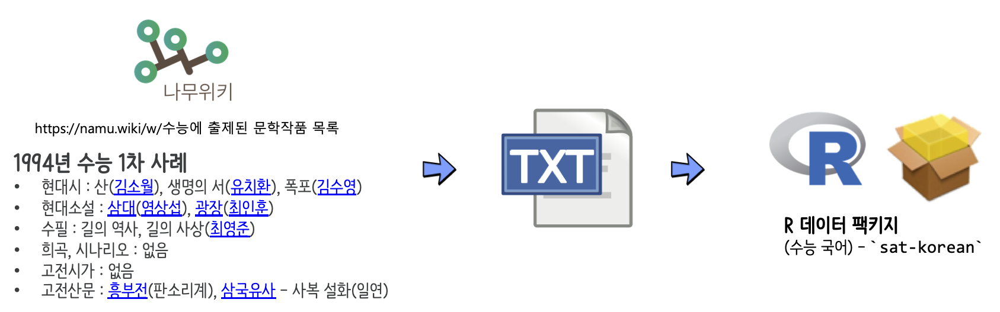

```{r, include=FALSE}
knitr::opts_chunk$set(echo = TRUE, message=FALSE, warning=FALSE,
                      comment="", digits = 3, tidy = FALSE, prompt = FALSE, fig.align = 'center')

library(tidyverse)
```


# 수능 국어 R 팩키지: `sat-korean` [^data-pkg-2016] [^how-to-build-pkg] {-#sat-korean-r-pkg}

[^data-pkg-2016]: [Clean Code and R-fun (2016), "Creating a package for your data set"](https://rmhogervorst.nl/cleancode/blog/2016/03/07/content/post/2016-03-07-create-package-for-dataset/)

[^how-to-build-pkg]: [Ed Hagen@WSU (2017/10/18), "Put your data in an R package"](https://grasshoppermouse.github.io/2017/10/18/put-your-data-in-an-r-package/)

수능 국어에 출제된 시, 소설, 수필 등 텍스트 데이터를 [나무위키, "수능에 출제된 문학작품 목록"](https://namu.wiki/w/수능에 출제된 문학작품 목록)을 참조하여 제작해본다.

{#id .class width="100%"}


# 대상 데이터셋 - 수능국어 {#text-dataset-korean}


