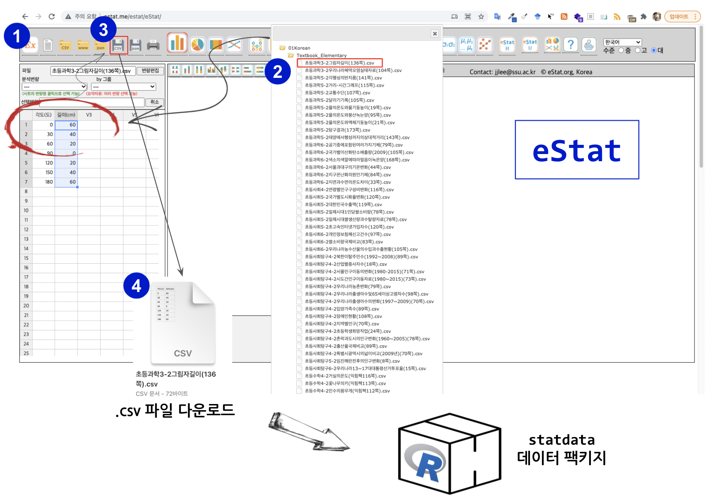

```{r, include=FALSE}
knitr::opts_chunk$set(echo = TRUE, message=FALSE, warning=FALSE,
                      comment="", digits = 3, tidy = FALSE, prompt = FALSE, fig.align = 'center')

library(tidyverse)
```

# 초중등 통계 데이터셋 {#stat-dataset}

[`eStat`](https://estat.me/estat/eStat/) 웹사이트에 정리된 초중등 데이터셋을 `statdata` 데이터 팩키지에 포함시킨다. 기본적인 작업 흐름은 [`eStat`](https://estat.me/estat/eStat/) 웹사이트에서 `Textbook_Elementary` 아래 포함된 csv 파일을 로컬 파일로 `.csv` 형태로 저장한 후에 R 데이터 팩키지 외부 데이터를 가져와서 데이터셋 문서화하는 방식으로 작업한다.



# R 데이터 팩키지 [^1] {#rdata-package}

[^1]: [유충현 (2021-09-04), "한글 R 패키지 개발 이슈 및 해결 방법"](https://choonghyunryu.github.io/develop_Korean_package/)

R 에서 데이터 팩키지를 생성하는 방식은 다음과 같다.

1.  `File` → `New Project` → `New Directory` → `R Package`

    -   데이터 팩키지 제작을 위한 기본 준비 완료

2.  GitHub 저장소 연결

    -   GitHub에 저장소를 하나 생성한다.
    -   `git remote add origin <GitHub 저장소 이름>` → `git remote add origin git@github.com:tidyverse-korea/statdata.git`
    -   `git add` → `git commit -m` → `git push --set-upstream origin statdata`

3.  [`statdata`](https://github.com/tidyverse-korea/statdata) 확인

# 데이터 팩키지 기여 {#rdata-package-contribution}

[`statdata`](https://github.com/tidyverse-korea/statdata) 팩키지에 기여하는 방식은 다음과 같다.

1.  `statdata` 팩키지 개발 저장소를 클론한다.

    -   `git clone git@github.com:tidyverse-korea/statdata.git`

2.  [`eStat`](https://estat.me/estat/eStat/) 웹사이트에서 데이터를 선택하여 `.csv` 파일로 저장한다.

3.  신규 데이터를 [`statdata`](https://github.com/tidyverse-korea/statdata) 데이터 팩키지에 반영한다.

    -   외부 데이터를 데이터 팩키지로 가져온다.
    -   `DATASET.R` 스크립트를 작성해서 외부데이터를 팩키지 데이터로 변환시킨다.
    -   `data.R` 스크립트를 작성해서 데이터에 대한 문서화 작업을 수행한다.
    -   오류사항을 수정한다.

4.  `Build` → `Check Package` 작업을 수행하여 다음 결과를 확인한 후에 Pull 요청을 보낸다.

```{r check-openstat-pkg, eval = FALSE}
── R CMD check results ───────────────────────────────────── statdata 0.1.0 ────
Duration: 13.7s

0 errors ✓ | 0 warnings ✓ | 0 notes ✓

R CMD check succeeded
```

# 데이터 팩키지 설치 {#install-data-pkg}

CRAN에 등록된 것이 아니라... GitHub에 저장된 데이터 팩키지라 [`tidyverse-korea/statdata`](https://github.com/tidyverse-korea/statdata) 저장소를 `devtools`나 `remotes` 팩키지로 설치하면 된다.

```{r data-pkg-install, eval = FALSE}
devtools::install_github("tidyverse-korea/statdata")
```


# 데이터 팩키지 활용 {#rdata-package-usage}

[`statdata`](https://github.com/tidyverse-korea/statdata) 팩키지를 설치하고 팩키지에 포함된 데이터를 확인한다.

<center>

{width="163"}

</center>

```{r load-statdata}
library(tidyverse)

csv_filenames <- fs::dir_ls(path = "data/rawdata/", glob = "*.csv")

openstat_raw <- purrr::map(csv_filenames, readr::read_csv)

openstat_tbl <- openstat_raw %>%
    tibble::enframe(name = "name", value = "content") %>%
    dplyr::mutate(name = fs::path_file(csv_filenames) %>% str_remove(pattern = "\\.csv$"))

openstat_tbl %>% 
  slice(1:10) %>% 
  gt::gt()
```


# `statdata` 초등과학 3-2 데이터셋 {#rdata-package-usage}

다음으로 `openstat_tbl` 티블 데이터프레임에 포함된 데이터셋을 추출하여 실제 활용을 한다.
[`statdata`](https://tidyverse-korea.github.io/statdata/) 웹사이트에서 데이터를 `Reference` 에서 찾아도 되고,
예를 들어 [`shadow_length`](https://tidyverse-korea.github.io/statdata/reference/shadow_length.html)를 찾아 데이터를 이해한 후에 적절한 분석 및 후속 작업을 이어가도 된다.


```{r use-stat-data}
library(statdata)
library(tidyverse)

data(shadow_length)

shadow_length
```

각도와 길이 관계를 시각적으로 파악해보자.

```{r 그림자길이}
shadow_length %>% 
  ggplot(aes(x = 각도, y = 길이)) +
    geom_line() +
    geom_point(size = 2) +
    theme_bw(base_family = "NanumGothic") + 
    labs(title = "그림자 길이",
         caption = "초등과학 3-2 그림자 길이 136쪽")
```

이와 유사한 방식으로 후속 작업을 이어가면 일일이 데이터를 찾아 `.csv` 파일로 저장하고 가져와서 필요하면 오류수정 등 불필요한 낭비되는 시간을 대폭 줄일 수 있다.

