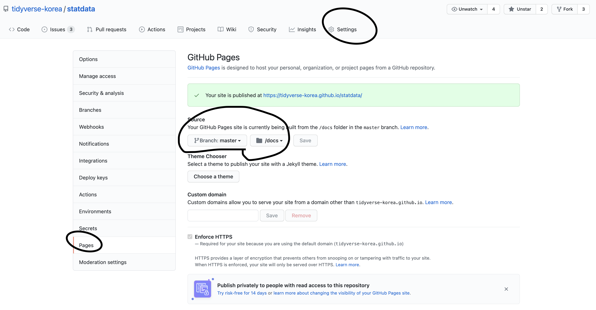

```{r, include=FALSE}
knitr::opts_chunk$set(echo = TRUE, message=FALSE, warning=FALSE,
                      comment="", digits = 3, tidy = FALSE, prompt = FALSE, fig.align = 'center')

library(tidyverse)
```

# 오픈 통계 팩키지 - R 데이터 팩키지 {-#openstat}

오픈 통계 팩키지에 포함되는 내장 데이터셋을 구성하는 R 데이터 팩키지를 참조한다.

- [GitHub 저장소: `statdata`](https://github.com/tidyverse-korea/statdata)
- [GitHub 저장소: `statdata` 데이터 팩키지 웹사이트](https://tidyverse-korea.github.io/statdata/)

# 팩키지 웹사이트 [^pkgdown-tutorial] {#pkg-website}

[^pkgdown-tutorial]: [John Muschelli, "R Package Development 6: Creating a pkgdown site"](https://www.youtube.com/watch?v=5C7-fYyjLH0&list=PLk3B5c8iCV-T4LM0mwEyWIunIunLyEjqM&index=6)

팩키지를 제작한 후에 팩키지에 대한 안내를 외부 웹사이트에 올려두게 되면 여러가지면에서 장점이 많다.

# `pkgdown` 설치 {#install-pkgdown}

가장 먼저 [`pkgdown`](https://pkgdown.r-lib.org/) 팩키지를 설치한다.

```{r install-pkgdown, eval = FALSE}
install.packages("pkgdown")
```

# `use_pkgdown()` 환경설정 {#use_pkgdown}

`use_pkgdown()` 명령어로 환경설정을 수행하게 되면 팩키지를 웹사이트 전환에 필요한 설정 기본작업을 자동으로 수행해 준다.

```{r use_pkgdown, eval = FALSE}
usethis::use_pkgdown()
```

# 웹사이트 생성 {#build-website}

`pkgdown:::build_site_external()` 명령어를 실행시키게 되면 R 팩키지 내용에 근거하여 웹사이트를 제작하여 `docs` 파일에 해당 결과물을 자동 배포한다.

```{r build_site_external, eval = FALSE}
pkgdown:::build_site_external()
```

# `gh-pages` 기능 설정 {#github-pages}

`git` 과 `github`을 사용해야 되기 때문에 해당 팩키지 개발 저장소를 GitHub에 연결시키는 작업을 완료하게 되면 url을 갖는 팩키지 웹사이트를 인터넷에 공개할 수 있다. 해당 팩키지가 git, github에 설정되지 않은 경우 다음 명령어를 사용한다.

- `usethis::use_git()` 
- `usethis::use_github()` 




