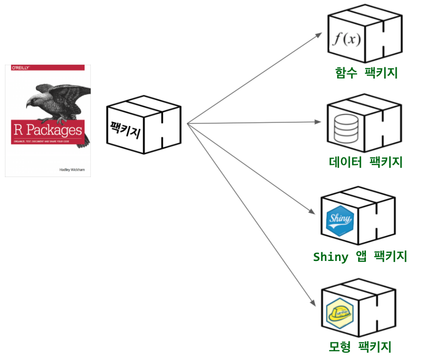
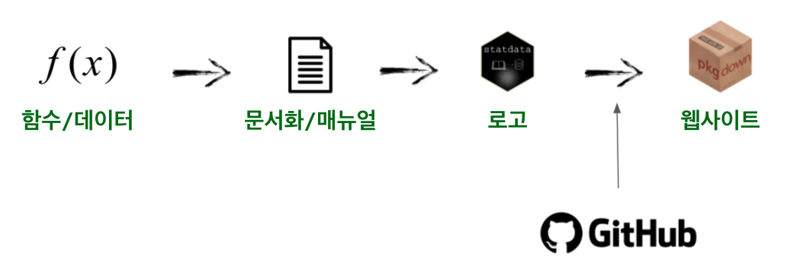

```{r, include=FALSE}
knitr::opts_chunk$set(echo = TRUE, message=FALSE, warning=FALSE,
                      comment="", digits = 3, tidy = FALSE, prompt = FALSE, fig.align = 'center')

library(tidyverse)
```



# `devtools`, `usethis` [^1] {#usethis-pkg}

[^1]: [Lluís Revilla Sancho (2021-09-04), "Creating packages with `devtools` and `usethis`", IDIBAPS, CIBEREHD](https://ghana.llrs.dev/#1)

-   ["Writing an R package from scratch"](https://r-mageddon.netlify.app/post/writing-an-r-package-from-scratch/)
-   ["R package development --- Maelle Salmon --- R-Ladies East Lansing & Chicago (English)"](https://www.youtube.com/watch?v=IlWMkz769B4)

<iframe width="300" height="180" src="https://www.youtube.com/embed/IlWMkz769B4?start=95" title="YouTube video player" frameborder="0" allow="accelerometer; autoplay; clipboard-write; encrypted-media; gyroscope; picture-in-picture" allowfullscreen>

</iframe>

# GUI 사용 팩키지 생성 {#pkg-creation}

RStuio GUI를 바탕으로 마우스 클릭을 사용해서 팩키지를 작성하는 방식은 다음과 같다.


`usethis` 팩키지 `usethis::create_package()` 함수를 사용해도 동일한 효과를 얻을 수 있다.

```{r tiger-pkg, eval = FALSE}
library(tidyverse)
library(usethis)

usethis::create_package("tiger")
```

결국 두가지 작업을 통해 일부 차이는 있지만 다음 R 팩키지 관련 파일이 우선 생성된다.

-   `DESCRIPTION` 파일
-   `R` 스크립트 파일
-   `man` 문서 파일
-   `NAMESPACE` 파일

추가로 RStudio Project 를 통해 R 팩키지를 생성하게 되면 다음 파일 생성된다. R 팩키지와 관련되지 않으나 R 팩키지를 R 프로젝트로 개발하게 될 경우 필요한 파일이다.

`tiger.Rproj` `.Rbuildignore` `.Rhistory`



# 팩키지 개발 작업흐름 {#pkg-workflow}

미래의 나를 비롯하여 다른 분들과 함수, 데이터, 앱, 모형 등을 공유할 경우 먼저 문서화를 통해 매뉴얼을 작성하고 로고를 비롯하여 웹사이트 제작까지 일련의 과정을 통해서 수행한다.

## 로고 제작 {#pkg-logo}

Shiny 앱 [`hexmake`](https://github.com/ColinFay/hexmake) 혹은 R 팩키지 [`hexSticker`](https://github.com/GuangchuangYu/hexSticker) 를 사용해서 로고를 제작한다. 제작한 로고를 `usethis::use_logo()` 함수를 사용하면 R 팩키지 `README.md` 파일에 반영시킬 수 있다.

```{r hexsticker-logo, eval = FALSE}
usethis::use_logo(img = "fig/statdata.png")
# statdata 
```

{width="119"}

## 웹사이트 제작 {#pkg-website}

[`pkgdown`](https://pkgdown.r-lib.org/) 팩키지를 사용해서 개발된 팩키지를 웹사이트에 올려 공개가 가능하다. 특히 GitHub의 `gh-pages` 기능을 활용할 경우 팩키지 변경을 비롯한 신규 기능 추가 및 버그 패치를 비롯하여 `Articles` 메뉴에 사용법도 함께 올려 DevOps도 별도의 개발과정 없이 수월히 적용 가능하다.

-   [`statdata`](https://tidyverse-korea.github.io/statdata/)
