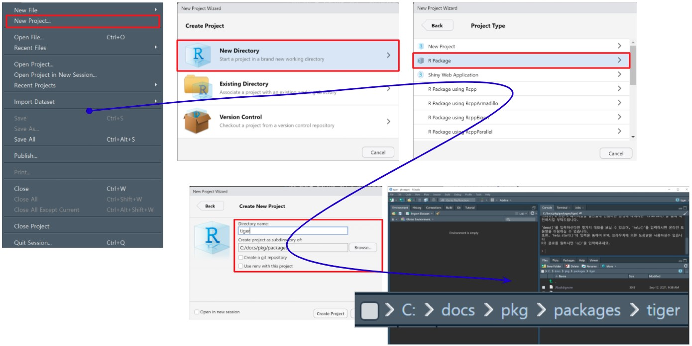

```{r, include=FALSE}
knitr::opts_chunk$set(echo = TRUE, message=FALSE, warning=FALSE,
                      comment="", digits = 3, tidy = FALSE, prompt = FALSE, fig.align = 'center')

library(tidyverse)
```


# `devtools`, `usethis` [^usethis-pkg] {#usethis-pkg}

[^usethis-pkg]: [Lluís Revilla Sancho (2021-09-04), "Creating packages with `devtools` and `usethis`", IDIBAPS, CIBEREHD
](https://ghana.llrs.dev/#1)

- ["Writing an R package from scratch"](https://r-mageddon.netlify.app/post/writing-an-r-package-from-scratch/)
- ["R package development — Maelle Salmon — R-Ladies East Lansing & Chicago (English)"](https://www.youtube.com/watch?v=IlWMkz769B4)

<iframe width="300" height="180" src="https://www.youtube.com/embed/IlWMkz769B4?start=95" title="YouTube video player" frameborder="0" allow="accelerometer; autoplay; clipboard-write; encrypted-media; gyroscope; picture-in-picture" allowfullscreen></iframe>

# GUI 사용 팩키지 생성 {#pkg-creation}


RStuio GUI를 바탕으로 마우스 클릭을 사용해서 팩키지를 작성하는 방식은 다음과 같다.



`usethis` 팩키지 `usethis::create_package()` 함수를 사용해도 동일한 효과를 얻을 수 있다.

```{r tiger-pkg, eval = FALSE}
library(tidyverse)
library(usethis)

usethis::create_package("tiger")
```


결국 두가지 작업을 통해 일부 차이는 있지만 다음 R 팩키지 관련 파일이 우선 생성된다.

- `DESCRIPTION` 파일
- `R` 스크립트 파일
- `man` 문서 파일
- `NAMESPACE` 파일

추가로 RStudio Project 를 통해 R 팩키지를 생성하게 되면 다음 파일 생성된다.
R 팩키지와 관련되지 않으나 R 팩키지를 R 프로젝트로 개발하게 될 경우 필요한 파일이다.

`tiger.Rproj`
`.Rbuildignore`
`.Rhistory`


